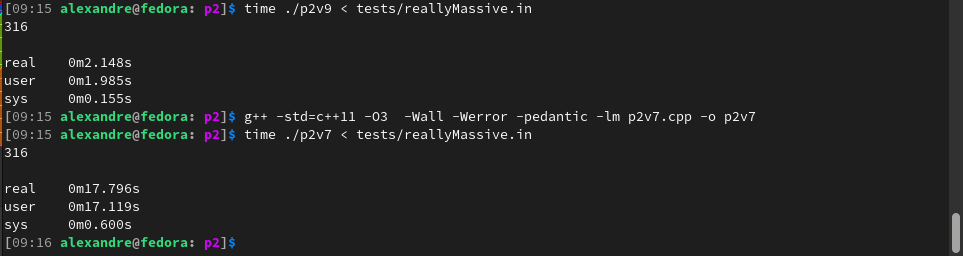
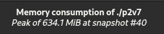
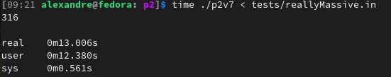

**Course**: Analysis and Synthesis of Algorithms
It took a few iterations before I got to this solution, which is in some ways the simplest.\
I also got some unexpected results out of a simple test:\
Here p2V7 used a c++ set (rb tree) representation of adjacencies and p2v9 uses a c++ vector representation of adjacencies

Switching p2V7 to an unordered set representation got me:

\
\
The reallyMassive test has 117mb worth of edges and vertices as raw text, but it was still surprising how much ram running it required.
I actually started out with an adjacency matrix, which didn't work out well at all since memory limits were a bit tight and some tesst had very sparse graphs.\
I have lost that version, but I recall in this same test it took upwards of 2gb of ram, but was still faster than the unordered set representation.\
That's strikes me as weird enough for me to suspect there was somethings wrong with the unordered set version, but arrays *are* shockingly fast so I'm not sure.\

All of this being said, even ignoring other differences between implementations, this 'test' is hardly a very scientific way to measure performance or memory requirements.\

